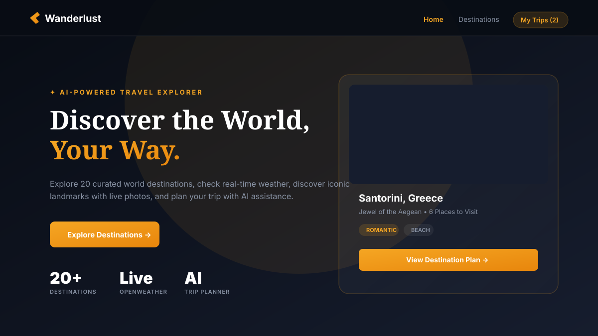
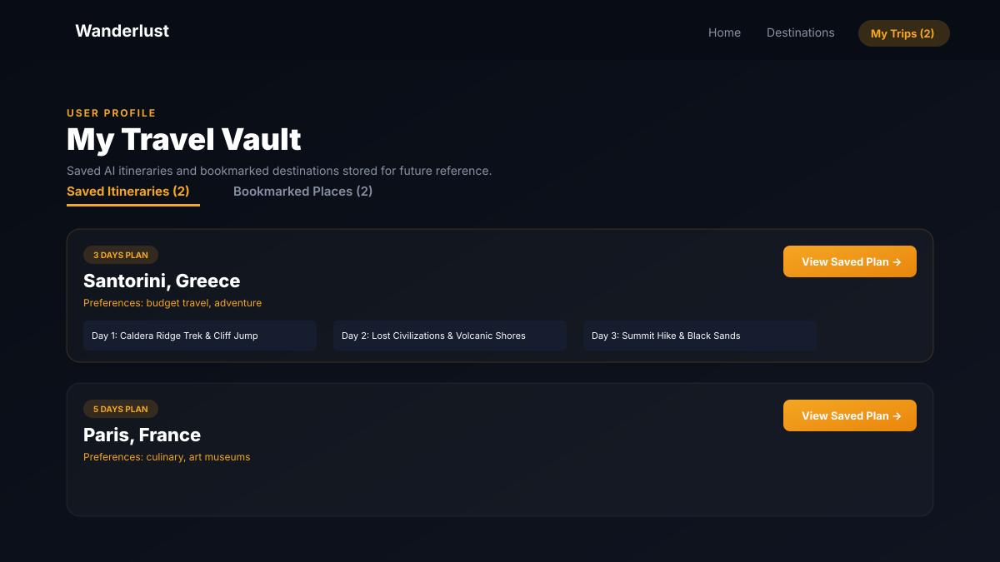

# ✈ Wanderlust — AI-Powered Travel Explorer

A modern, design-led travel web application built for the **Front-End Developer Assessment** at **Design Esthetics**.

🔗 **Live Deployed Application**: [https://wanderlust-cyan-three.vercel.app/](https://wanderlust-cyan-three.vercel.app/)  
💻 **GitHub Repository**: [https://github.com/prakashpaulpandi/Wanderlust](https://github.com/prakashpaulpandi/Wanderlust)

---

## 📸 Application Screenshots

### 01. Landing Experience & Hero Explorer


### 02. My Travel Vault & Saved AI Itineraries


---

## 🌟 Key Features

| # | Feature | Description |
|---|---|---|
| **01** | **Landing Experience** | Looping video hero background, responsive dark luxury theme (`#080c14` + `#f5a623` amber gold), Framer Motion entrance animations. |
| **02** | **Destination Explorer** | 20 curated world destinations across 6 continents. Search by city/country name with debounced inputs and multi-category filtering. |
| **03** | **Famous Places** | High-definition landmark photos loaded dynamically from **Pexels API** with structured location descriptions and numbered badges. |
| **04** | **Location Awareness** | Browser **Geolocation API** coordinates lookup with manual city search fallback and permission-denied state handling. |
| **05** | **Real-Time Weather** | Live weather data powered by **OpenWeather API** (temperature, feels-like, condition icon, humidity, wind speed, visibility). |
| **06** | **AI Chatbot** | Conversational assistant powered by **Google Gemini API** (`gemini-3.6-flash`) with suggested prompt chips and real-time typing indicators. |
| **07** | **Itinerary Planner** | AI-generated 2 to 10-day travel plans rendered as interactive, expandable Day cards with morning/afternoon/evening periods. Auto pre-loads saved itineraries. |
| **08** | **User Profile & Saved Trips** | Full authentication/login system (`/login`) and saved trips vault (`/saved`) to store itineraries and bookmarked places permanently. |

---

## 🛠️ Tech Stack & APIs

- **Frontend**: React 18 + Vite
- **Routing**: React Router DOM v6
- **Animations**: Framer Motion
- **Styling**: Vanilla CSS with design-led dark mode tokens & glassmorphic navigation
- **Persistence**: LocalStorage state synchronization
- **APIs Used**:
  - 🌤️ **OpenWeather API**: Live weather & forecast data
  - 📸 **Pexels API**: Dynamic destination & place imagery
  - 🤖 **Google Gemini API**: AI travel chatbot & structured itinerary generator

---

## 🚀 How to Run Locally

### Prerequisites
- Node.js 18.0 or higher
- npm 9.0 or higher

### Steps

1. **Clone the repository**:
   ```bash
   git clone https://github.com/prakashpaulpandi/Wanderlust.git
   cd Wanderlust
   ```

2. **Install dependencies**:
   ```bash
   npm install
   ```

3. **Set up Environment Variables**:
   Create a `.env` file in the project root directory:
   ```env
   VITE_OPENWEATHER_API_KEY=your_openweather_api_key_here
   VITE_PEXELS_API_KEY=your_pexels_api_key_here
   VITE_GEMINI_API_KEY=your_gemini_api_key_here
   ```

4. **Run Development Server**:
   ```bash
   npm run dev
   ```
   Open [http://localhost:3000](http://localhost:3000) in your browser.

5. **Build for Production**:
   ```bash
   npm run build
   ```

---

## 📄 License & Credits

Built for the **Design Esthetics Front-End Assessment**.  
© 2026 Wanderlust.
